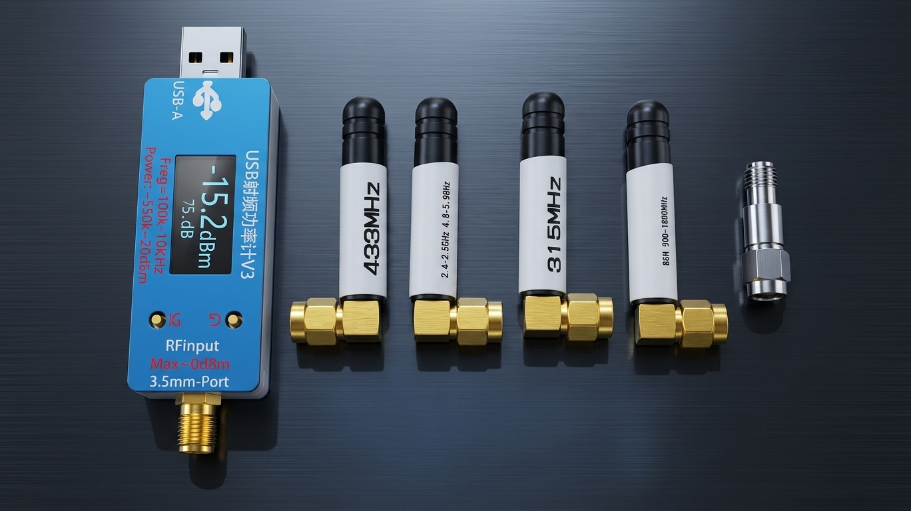
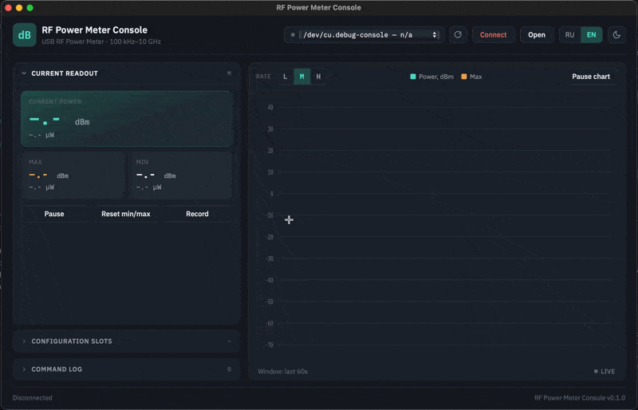

# RF Power Meter Console

<p align="center">
  
</p>

Cross-platform desktop app for the USB RF Power Meter V3.0 100K To 10GHZ -55 To +30dBm Prestored 9 Attenuation Curves 0.96" Color Display. Runs on macOS, Windows and Linux.

<p align="center">
  
</p>

[Читать на русском](README_ru.md)

## Features

- Live power readout (dBm / power) with a rolling 60s chart, min/max tracking
- 9 configuration slots (frequency + offset), click a card to switch the
  device's active slot, edit via the pencil popover
- Sample rate switch (L / M / H)
- Command log of everything sent to and received from the device
- Recording: capture readings to CSV (with active slot, frequency and offset
  per row), then reopen a CSV in a dedicated full-width analysis view with a
  hover tooltip and a horizontally scrollable chart
- Dark / light themes, English / Russian UI
- Serial port selector with manual refresh

## Running on Linux

The release ships an `.AppImage` with GTK + WebKit bundled inside it, so no
system packages need to be installed:

```bash
chmod +x RFPowerMeterConsole-linux.AppImage
./RFPowerMeterConsole-linux.AppImage
```

## Development

```bash
python3 -m venv .venv
.venv/bin/pip install -r requirements-dev.txt
.venv/bin/python3 main.py
```

`requirements-dev.txt` additionally installs PyInstaller for local packaging;
`requirements.txt` alone is enough to just run the app.

## Building a standalone binary

```bash
.venv/bin/pyinstaller --noconfirm --clean --name RFPowerMeterConsole \
  --windowed --icon assets/icon.icns \
  --add-data "web:web" --add-data "assets:assets" main.py   # macOS
```

On Linux, drop `--windowed`/`--icon`/`--onefile` (PyInstaller's `--icon` is a
no-op there) — the release build instead wraps the resulting `dist/`
folder into a self-contained `.AppImage` with `linuxdeploy` (see
`.github/workflows/build.yml`), which is how GTK/WebKit end up bundled
instead of relying on system packages. On Windows, use `--icon
assets\icon.ico` and `--add-data "web;web" --add-data "assets;assets"`
(semicolon separator), and add `--onefile` if you want a single `.exe`.

The output is written to `dist/`.

## Releasing

Pushing a tag matching `v*.*.*` triggers `.github/workflows/build.yml`,
which builds the app for macOS, Windows and Linux with PyInstaller and
opens a **draft** GitHub release with the packaged artifacts attached.
Nothing is published automatically — review the draft and publish it
manually from the repository's Releases page.

```bash
git tag v0.1.0
git push origin v0.1.0
```

You can also trigger a build without releasing via the workflow's
"Run workflow" button (`workflow_dispatch`) — it still produces build
artifacts but only creates a release when triggered by a tag push.

## Device protocol

See [`PROTOCOL.md`](PROTOCOL.md) for the reverse-engineered serial protocol
reference (baud rate, command formats, timing quirks).
